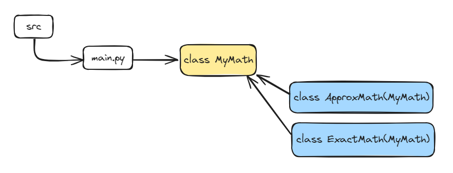

# Esercizi

1) poetry --> [README](poetry_exercise/README.md)
---
2) esercizio Mathematical Function --> [main](poetry_exercise/src/main.py)

Schema progetto:

- classe genitore: `MyMath`--> definisce i metodi  `sqrt(x)` e `sin(x)`
- classi figlie --> `ApproxMath` e `ExactMath` implementano i due metodi della classe genitore, ognuna a suo modo